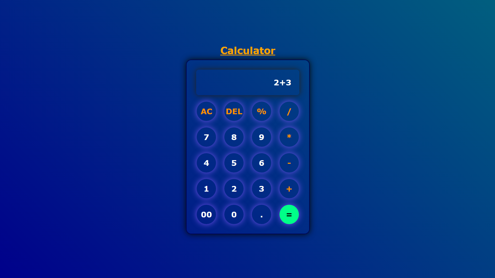

# 🧮 Interactive Calculator

<div align="center">
  
  
  
</div>

<br>

A responsive, custom-built interactive calculator designed to solidify foundational UI design, DOM manipulation, and core web development principles. 

## ✨ Features

* **Modern UI:** Features a sleek, dark-themed interface with neon/glow effects and soft shadows for a premium look.
* **Core Functionality:** Supports standard arithmetic operations including addition, subtraction, multiplication, division, and percentage calculations.
* **Interactive Elements:** Includes clear (AC) and delete (DEL) functionalities for seamless user correction.
* **Responsive Design:** Adapts smoothly across different screen sizes.

## 📸 Preview



## 🛠️ Tech Stack

* **HTML5:** Semantic structure and layout.
* **CSS3:** Custom styling, flexbox/grid layouts, and hover animations.
* **Vanilla JavaScript:** Event handling, logic execution, and DOM manipulation.

## 🚀 Getting Started

To view or run this project locally, follow these simple steps:

1. **Clone the repository:**
   ```bash
   git clone [https://github.com/zakiali2006/Interactive-Calculator.git](https://github.com/zakiali2006/Interactive-Calculator.git)
